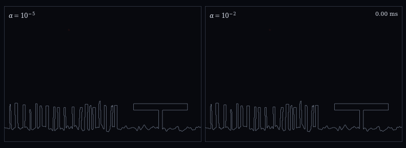
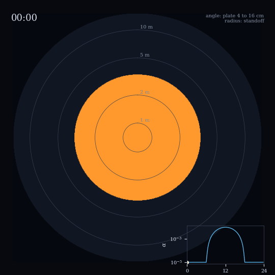
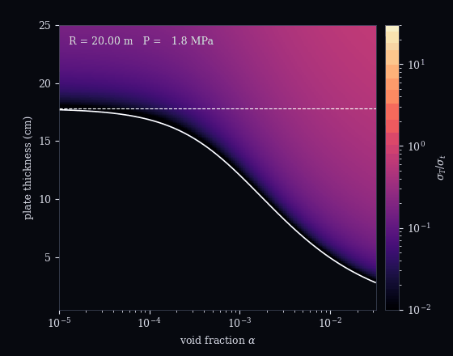

# Idealized blast-fishing shock loading beneath gas-laden coral canopies

[](https://www.python.org)
[](https://numpy.org)
[](https://scipy.org)
[](https://peps.python.org/pep-0008/)
[](LICENSE)

Supplementary code for a reduced-order model of how free gas in a coral
canopy changes the loading that an improvised fishing charge delivers to
reef skeleton. Analysis only: no field data, no calibration.

**Authors:** Sandy H. S. Herho, Rizki D. Permana, Iwan P. Anwar,
Alfita P. Handayani, Faruq Khadami, Karina A. Sujatmiko, Dasapta E. Irawan

<p align="center">
  <br>
  <sub>One charge, two canopies: void fraction 10<sup>-5</sup> (left) and 10<sup>-2</sup> (right). Amber compression, blue tension.</sub>
</p>

<table>
  <tr>
    <td align="center"></td>
    <td align="center"></td>
    <td align="center"></td>
  </tr>
  <tr>
    <td align="center"><sub>Damage map over a day (radius: standoff, angle: plate thickness)</sub></td>
    <td align="center"><sub>Forty canopy bubbles under one pulse</sub></td>
    <td align="center"><sub>Critical plate thickness as range closes</sub></td>
  </tr>
</table>

<p align="center">
  <br>
  <sub>Reverberation in water, canopy, plate, canopy; the bar converges to the impulse invariant.</sub>
</p>

## Key results

Gas and liquid compliances of the canopy are equal at

```math
p^* = \frac{\alpha K_l}{1-\alpha},
```

about 2.3 MPa at $`\alpha = 10^{-3}`$. Blast-strength shocks above $`p^*`$
see a nearly transparent canopy.

For any lossless stack between water and a half-space of impedance
$`Z_b`$, the transmitted impulse is exactly $`2Z_b/(Z_b+Z_w)`$ times the
incident impulse. Gas redistributes the pulse in time but cannot change
its impulse.

A plate of thickness $`d`$ carries first-reflection tension if and only if

```math
\frac{Z_c}{Z_s} < \tanh\delta, \qquad \delta = \frac{d}{c_s\theta}, \qquad d_c = c_s\theta\,\mathrm{artanh}\frac{Z_c}{Z_s}.
```

| 1 kg TNT equivalent, charge directly overhead | value |
| :-- | :-- |
| critical thickness, water-backed, standoff 2 to 10 m | 10.7 to 15.3 cm |
| critical thickness, void fraction 3e-2 | 3.5 to 5.3 cm |
| spall standoff, 12 cm plate, void fraction 1e-5 to 2.7e-2 | 1.75 to 5.70 m |
| crush standoff, same plate | 3.37 to 2.51 m |
| noon spall standoff, peak void fraction 1e-2 / 3e-2 (night 1.75 m) | 4.3 / 5.7 m |
| 2D median tension-to-compression ratio, 1e-5 to 1e-2 | 0.14 to 0.19 |

Every canopy effect requires void fractions of order 1e-3 or more. Failure
first occurs at depth $`x^* = (c_s\theta/2)\ln[1/(|R_b| - \sigma_t/P_s)]`$
behind the back face, which sets the spall scab thickness.

## Verification

| check | result |
| :-- | :-- |
| Goupillaud vs ray sum vs transfer matrix, max abs | 2.2e-16, 4.4e-16 |
| impulse invariant, three solvers, relative | 2.2e-16 |
| plate first reflection vs closed form | 2.2e-16 |
| Hugoniot to Wood limit, slope | 0.9998 |
| Keller-Miksis nonlinear frequency shift, slope (expected 2) | 1.978 |
| DOP853 vs Radau | 5e-13 |
| 2D self-convergence orders | 2.59, 0.81 |

Full residuals are in `outputs/reports/verification.txt`.

## Run

```bash
pip install -r requirements.txt
python scripts/run_all.py
```

About fifteen minutes on one core. The 2D runs and the convergence study
cache to `outputs/cache/` and are skipped on reruns.

## Layout

```
reefblast/   core, canopy, stack, damage, bubble, fdtd, diel, scenario,
             plotting, anim, io_utils
scripts/     fig00-fig08, anim01-anim05, make_reports, run_all
outputs/     figures (PDF, 600 dpi PNG), animations (GIF),
             data (CSV per panel), reports (plain text)
```

## Limitations

- **Void fraction** is a free parameter; no measurement in a coral canopy
  is known to the authors.
- **Geometry**: all ranges are vertical standoffs at normal incidence.
  Horizontal radii are not computed, because beyond the 30° critical angle
  no compressional wave enters an acoustic skeleton.
- **Relaxed canopy**: the secant impedance assumes bubbles equilibrate
  within the shock, which Figure 4 shows they do not, so canopy effects are
  likely upper bounds.
- **Cavitation** above the canopy is omitted; the impulse invariant holds
  for the linear model only.
- **Strength and source**: static strength and Cole constants fitted to
  large charges are used; spall standoffs are likely upper bounds.
- **2D runs** use a line source exact only in the far field and are used
  only for amplitude-free ratios.

Details are in `outputs/reports/open_items.txt`.

## License

MIT
